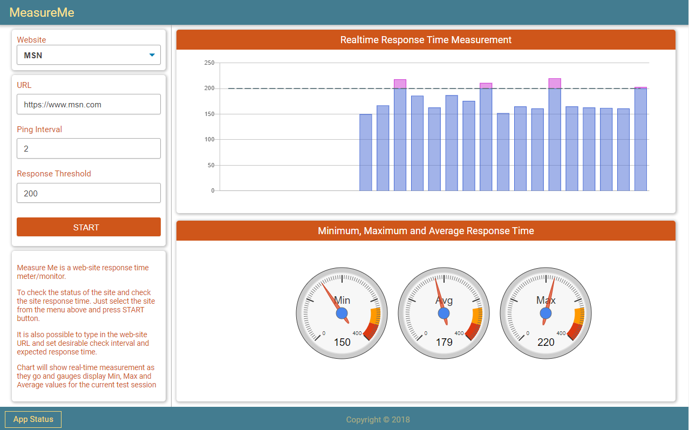
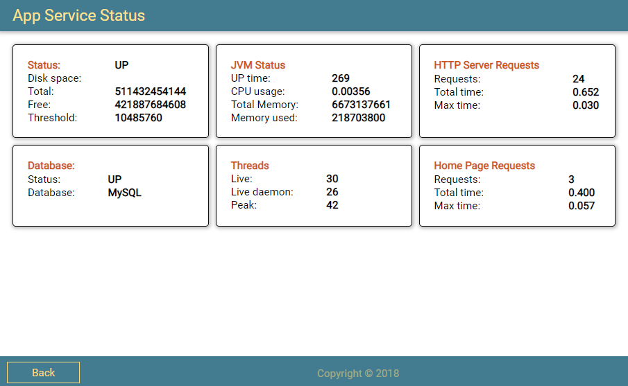

# MeasureMe


MeasureMe is a simple web service that measures internet websites request-response roundtrip time. Unlike ping utility, the app makes Http calls and measures time from a request sent and a response received. It not intended to take an accurate measurement, just to give an idea of what a delay you can expect from the particular website. The app makes repetitive calls and displays results on the graphs.

## The application build using following technologies:
#### Backend and Persistence:
- Java-11
- Spring boot
- Spring Data Jpa
- MySQL

#### Frontend:
- Thymeleaf
- HTML
- SCSS/CSS
- JavaScript
- Chart.js
- Google Charts

## Under the hood

The application developed to explore specific technics that can be useful in developing web applications.

#### Spring Conversion Service
The application relays on Spring ***ConvertionSerivce*** to transform DTO Entity to Domain Entity by querying backend services.

```java
public MeasureSession convert(MeasurementsDto source) {
	
	Optional<Website> data = websiteService.findByNameIgnoreCase(source.getWebsiteName());
	
	Website website = data.orElse(new Website());
	
	MeasureSession session = sessionService.findById(source.getSessionId()).orElse(new MeasureSession());
	session.setWebapp(source.getWebAppName());
	session.setWebappVersion(source.getWebAppVer());

	website.getMeasureSessions().add(session);
	session.setWebsite(website);
	
	MeasureResult result = new MeasureResult();
	result.setRequestTime(source.getRequestTime());
	result.setResponseTime(source.getResponseTime());
	
	session.getMeasurementResults().add(result);
	result.setMeasureSession(session);
	
	return session;
}
```

#### Open projections
The repository typically returns one or more instances of the Entity class. However, sometimes, we don't need all the properties of the returned objects, just part of them.  In this type of situation, projections come in handy.
The application is using ***open projection*** allows defining interface methods that can returns values computed at runtime.

```java
public interface CalculatedDelay extends BaseNumber {

	@Value("#{target.responseTime - target.requestTime}")
	long getLong();
}
```

#### Thymeleaf & JavaScript Modules
The application is using the [Thymeleaf](https://www.thymeleaf.org/) framework to render web pages in conjunction with JavaScript. JavaScript modules are providing data exchange functionality as well as supporting and updating charts.

#### Fetch API
The application is exchanging data between the browser and the server while taking measurements by sending **POST** and **GET** requests. And doing so, it uses Fetch API interface. [Fetch API](https://developer.mozilla.org/en-US/docs/Web/API/Fetch_API) is seemed similar to XMLHttpRequest, but more powerful and flexible.

The application is using basic fetch functionality, good enough to exchange data. 
```javascript
async function updateData(url = '', data = {}, method = 'POST') {
	const response = await fetch(url,
			{
				method: method,
				headers: {'Content-Type' : 'application/json'},
				mode: 'same-origin',
				body: JSON.stringify(data)
			});
	
	return await response.json();
}
```
```javascript
fetch(url)
	.then(res => res.json())
	.then(data => gaugeMeter.updateValues(data))
	.catch((error) =>{
		...error handler here;
	});
```

#### SCSS/CSS
The frontpage layout is based on the [CSS Grid layout](https://developer.mozilla.org/en-US/docs/Web/CSS/CSS_Grid_Layout). Grid layout makes it easier to design web pages without having to use floats and positioning. Using CSS Grid layout makes it very easy to adjust the page content a screen size.
```css
// Desktop & laptop
@include mediaLg {
  #wrapper {
    grid-template-columns: repeat(4, 1fr);
    grid-template-areas:
      "header header header header"
      "sidebar main main main"
      "footer footer footer footer";
    grid-template-rows: 60px auto 60px;
  }
....
```
```css
// Tablets & Small Laptops
@include mediaMd {
  #wrapper {
    grid-template-columns: 1fr;
    grid-template-areas:
      "header"
      "sidebar"
      "main"
      "footer";
    grid-template-rows: 48px auto auto 48px;
  }
```

All styling done in SCSS then compiled to a regular CSS file.
```css
// re-use code example
@mixin box {
  border-radius: 5px;
  box-shadow: 1px 1px 5px 2px rgba(#333, 0.3);
}
...
section {
  &.gauge {
    @include box;
    margin: 10px 25px 10px 10px;
  }
}
```

#### Spring Actuator
As additional functionality, the application provides a very simple App Service Status by using [Spring Actuator](https://docs.spring.io/spring-boot/docs/current/reference/html/production-ready-features.html). The page intended to demonstrate usage of the Spring Actuator to monitor different aspects of the service.




#### Conclusion

This is a simple spring-boot web service written as an exercise and provides no security or validation of who is using it.

#### Licence

This project is licensed under the terms of the MIT license.